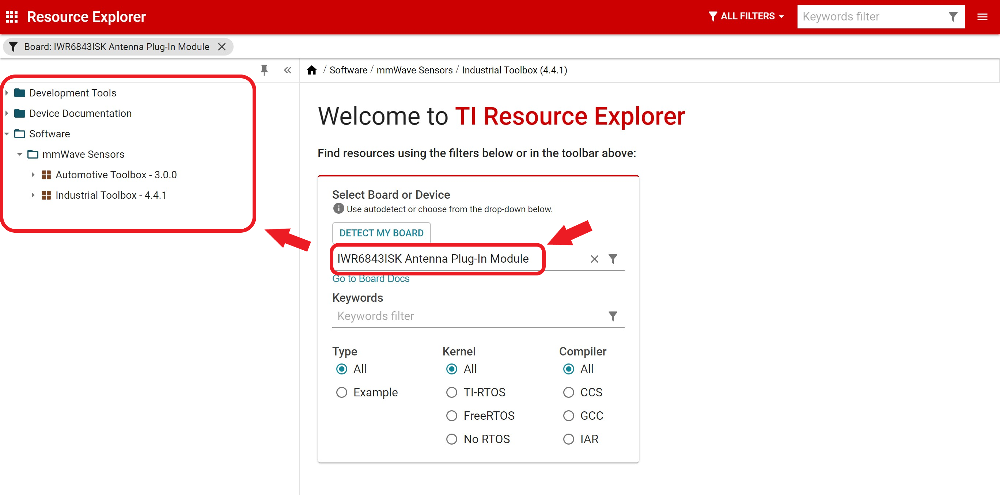

# Development Board guide
In this document you can find user's guide, developer's guide and bunch of stuff you need to know/do to get your hands on the TI board, namely, IWR6843ISK

## Software you need
- Download and install [code composer studio](https://www.ti.com/tool/CCSTUDIO?utm_source=google&utm_medium=cpc&utm_campaign=epd-null-null-GPN_EN_EVM-cpc-evm-google-wwe&utm_content=CCSTUDIO&ds_k=CCSTUDIO&DCM=yes&gclid=CjwKCAjwr7X4BRA4EiwAUXjbt5WNYu3KnUmFJ7jZLAX4p1tBGh7A8eTKPsBaW1CUVe17mSZvSTBflhoC3k8QAvD_BwE&gclsrc=aw.ds) IDE. You can find a tutorial video to get familiar with the environment.

- Navigate to 'Resource Explorer' from 'getting started' page.

- You can filter out the resources by typing your board's name. In our case, "IWR6843ISK Antenna Plug-In Module"
 

- By navigating to `./Software/mmWave Sensors/ Industrial Toolbox (4.4.1)/ Labs/` you can find the example projects. The closest ones to this project are *long_range_people_detection* and *People Counting*.
<!-- *long_range_people_detection/ 68xx ISK - 100m Outdoor People Tracking and False Detection Filtering* -->
<!-- TODO: Which ones exactly? subfolders in both of the lab projects -->
  `User's guide` will give you a quick overview of that project, as well as the setup up you need to run the project.
  
  If you'd like to contribute to the project, you can also find the developer's guide here.

- For this project, *People Counting* example project is used with tuning the configuration <!-- WHICH .cfg file? --> <!-- TODO: explain .cfg file as well -->

<!-- TODO: anything else? -->
<!-- i cannot see the .cpp or .c code in repo. only the .cfg file, tell me how to, which code, flash which micro -->